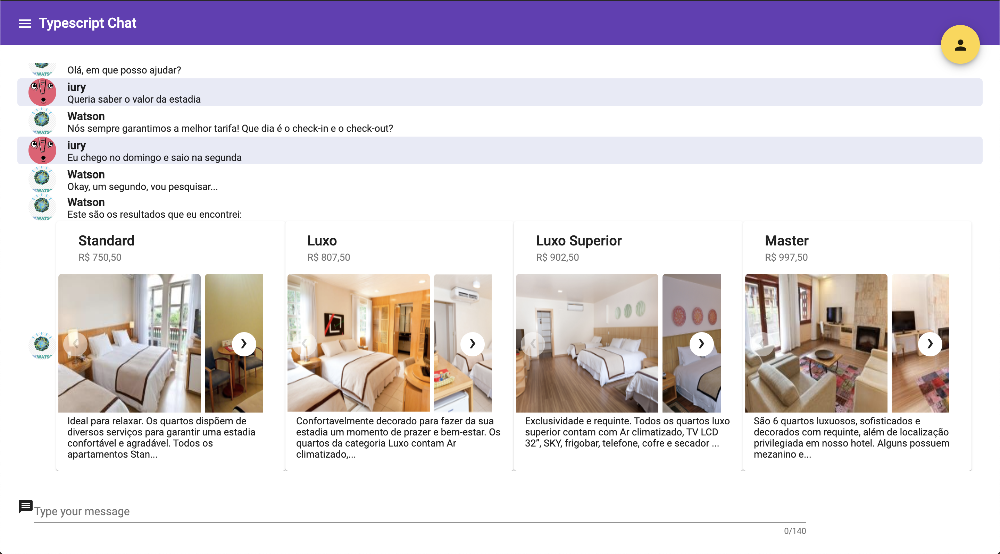
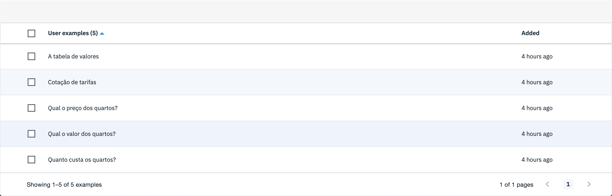
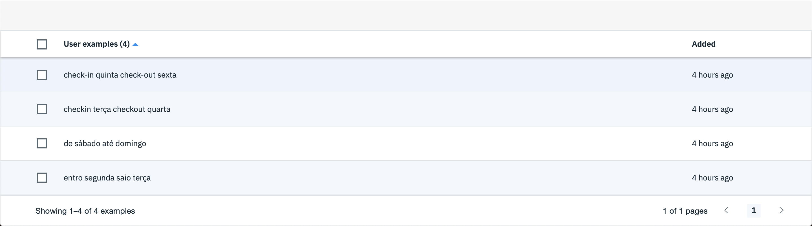

# Robô Crawler

Prova de conceito para um robô crawler com Cheerio e Puppeteer, com adicional chat baseado em angular com comunicação por Socket.io e simulador de atendente pelo Ibm Watson Assistant.

## Getting Started

Essas instruções fornecerão uma cópia do projeto rodando na sua máquina local para fins de desenvolvimento e teste.

### Pré-requisitos

Você vai precisar dos seguintes softwares instalados na sua máquina
- [Node.js](https://nodejs.org/en/download/) (>= 8.1.3 obrigatório)
- [Angular CLI](https://nodejs.org/en/download/) (>= 8.3.12 opcional, somente se quiser rodar o front-end)

### Instalação

Clone o repositório

```
git clone https://github.com/IuryPiva/crawler-robot.git
```

Navegue até a pasta criada

```
cd crawler-robot
```

Navegue até a pasta do servidor

```
cd server
```

Instale as dependências

```
npm install
```

Inicie o servidor
```
npm start
```

O servidor está pronto para receber requisições, exemplo:
```
curl -d '{"checkin":"27102019", "checkout":"28102019"}' -H "Content-Type: application/json" -X POST http://localhost:3000/buscar
```

Se quiser rodar o front-end, navegue até a pasta `client`instale as dependências com `npm install` e utilize o Angular CLI para rodar o projeto `ng s`

Para utilizar o chatbot remova `.example` do arquivo `.env.example` e substitua a chave e id.

## Exemplos de interação com pelo chat
 - Interação completa

 - Exemplos de cotação de tarifa

 - Exemplos de busca



## Construído com

* [Cheerio](https://github.com/cheeriojs/cheerio) - Implementation of core jQuery designed specifically for the server.
* [Express](https://expressjs.com/) - Minimalist web framework for Node.js.
* [Puppeteer](https://developers.google.com/web/tools/puppeteer) - A Node library which provides a high-level API to control headless Chrome or Chromium over the DevTools Protocol.
* [IBM Watson Assistant](https://www.ibm.com/cloud/watson-assistant/) - Watson Assistant is an offering for building conversational interfaces into any application, device, or channel.
* [Angular](https://angular.io/) - A Javascript-based front-end web framework.
* [Socket.io](https://socket.io) - a JavaScript library for realtime web applications. It enables realtime, bi-directional communication between web clients and servers.


## Autor

* **Iury Dias Piva** - [IuryPiva](https://github.com/iurypiva)
